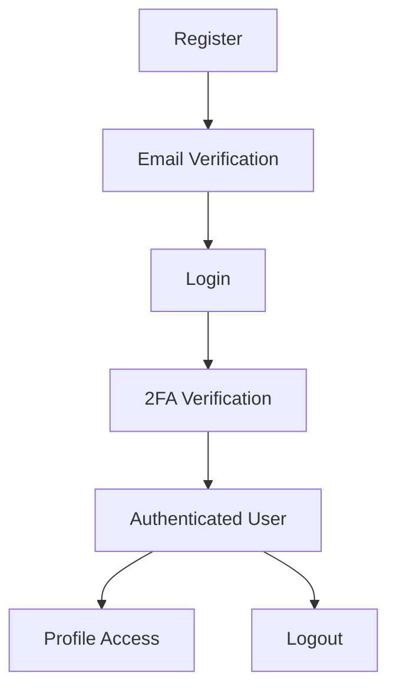

# 🎮 Transcendence Frontend API Integration Guide

## 📋 Overview
Bu dokümantasyon, Transcendence authentication sistemini frontend'e entegre etmek için gerekli tüm API endpoint'lerini ve kullanım örneklerini içerir.

## 🌐 Base URL
```
https://localhost:8080/api/auth
```

## 🔐 Authentication Flow


---

## 📚 API Endpoints

### 1. 🏥 **Health Check**
Servis durumunu kontrol et.

**Endpoint:** `GET /health`

**Response:**
```json
{
  "success": true,
  "service": "authentication-service",
  "status": "healthy",
  "timestamp": "2025-08-31T14:00:00.000Z",
  "version": "1.0.0"
}
```

---

### 2. 📝 **User Registration**
Yeni kullanıcı kaydı.

**Endpoint:** `POST /register`

**Request Body:**
```json
{
  "username": "johndoe",
  "email": "john@example.com", 
  "password": "SecurePass123"
}
```

**Validation Rules:**
- `username`: 3-50 karakter, unique
- `email`: Valid email format, unique
- `password`: Minimum 8 karakter

**Success Response (201):**
```json
{
  "success": true,
  "message": "User registered successfully. Please check your email for verification code.",
  "user": {
    "id": 1,
    "username": "johndoe",
    "email": "john@example.com",
    "is_active": false,
    "created_at": "2025-08-31T14:00:00.000Z"
  },
  "next_step": "email_verification"
}
```

**Error Responses:**
- `400 Bad Request`: Missing fields → HTML error page
- `409 Conflict`: User exists → HTML error page  
- `500 Internal Error`: System error → HTML error page

---

### 3. ✉️ **Email Verification**
Email doğrulama (kullanıcı email'deki linke tıklar).

**Endpoint:** `GET /verify-email?token={verification_token}`

**Parameters:**
- `token`: 64 karakterlik hex string (email'den gelir)

**Success Response (200):**
```html
<!-- Güzel HTML success sayfası -->
<!-- Otomatik 5 saniye sonra ana sayfaya yönlendirir -->
```

**Error Responses:**
- `400 Bad Request`: Invalid/expired token → HTML error page
- `404 Not Found`: User not found → HTML error page

---

### 4. 🚪 **User Login**
Kullanıcı girişi (2FA kodu tetikler).

**Endpoint:** `POST /login`

**Request Body:**
```json
{
  "login": "john@example.com",  // Email veya username
  "password": "SecurePass123"
}
```

**Success Response (200):**
```json
{
  "success": true,
  "message": "Login initiated. Please check your email for 2FA code.",
  "next_step": "2fa_verification",
  "email": "john@example.com"
}
```

**Error Responses:**
- `400 Bad Request`: Already logged in → HTML warning page
- `401 Unauthorized`: Invalid credentials → HTML error page
- `403 Forbidden`: Email not verified → HTML warning page
- `500 Internal Error`: System error → HTML error page

---

### 5. 🔐 **2FA Verification**
İki faktörlü doğrulama.

**Endpoint:** `POST /verify-2fa`

**Request Body:**
```json
{
  "email": "john@example.com",
  "code": "123456"  // 6 haneli kod email'den
}
```

**Success Response (200):**
```json
{
  "success": true,
  "message": "Login successful",
  "user": {
    "id": 1,
    "username": "johndoe",
    "email": "john@example.com",
    "is_active": true,
    "last_login_at": "2025-08-31T14:00:00.000Z"
  }
}
```

**Cookie Set:**
```
Set-Cookie: accessToken=jwt_token_here; HttpOnly; Secure; SameSite=Strict; Path=/; Max-Age=86400
```

**Error Responses:**
- `400 Bad Request`: Invalid/expired code → HTML error page
- `404 Not Found`: User not found → HTML error page

---

### 6. 👤 **Get Profile** (Authenticated)
Kullanıcı profilini getir.

**Endpoint:** `GET /profile`

**Authentication:** JWT Cookie (otomatik)

**Success Response (200):**
```json
{
  "success": true,
  "user": {
    "id": 1,
    "username": "johndoe", 
    "email": "john@example.com",
    "is_active": true,
    "last_login_at": "2025-08-31T14:00:00.000Z",
    "created_at": "2025-08-31T13:00:00.000Z"
  }
}
```

**Error Response:**
- `401 Unauthorized`: Not authenticated
- `404 Not Found`: User not found

---

### 7. 🚪 **Logout** (Authenticated)
Kullanıcı çıkışı.

**Endpoint:** `POST /logout`

**Authentication:** JWT Cookie (otomatik)

**Success Response (200):**
```json
{
  "success": true,
  "message": "Logged out successfully"
}
```

---

### 8. ✅ **Username Availability**
Kullanıcı adı müsaitlik kontrolü.

**Endpoint:** `GET /check-username?username={username}`

**Response:**
```json
{
  "exists": false,
  "message": "Kullanıcı adı kullanılabilir"
}
```

---

### 9. ✅ **Email Availability**  
Email müsaitlik kontrolü.

**Endpoint:** `GET /check-email?email={email}`

**Response:**
```json
{
  "exists": false,
  "message": "E-posta adresi kullanılabilir"
}
```

---

## 🎨 Frontend Implementation Examples

### **React/JS Authentication Hook**
```javascript
// authService.js
class AuthService {
  constructor() {
    this.baseURL = 'https://localhost:8080/api/auth';
  }

  async register(userData) {
    const response = await fetch(`${this.baseURL}/register`, {
      method: 'POST',
      headers: { 'Content-Type': 'application/json' },
      body: JSON.stringify(userData)
    });
    return await response.json();
  }

  async login(credentials) {
    const response = await fetch(`${this.baseURL}/login`, {
      method: 'POST', 
      headers: { 'Content-Type': 'application/json' },
      body: JSON.stringify(credentials)
    });
    return await response.json();
  }

  async verify2FA(email, code) {
    const response = await fetch(`${this.baseURL}/verify-2fa`, {
      method: 'POST',
      headers: { 'Content-Type': 'application/json' },
      body: JSON.stringify({ email, code })
    });
    return await response.json();
  }

  async getProfile() {
    const response = await fetch(`${this.baseURL}/profile`, {
      credentials: 'include' // Cookie gönder
    });
    return await response.json();
  }

  async logout() {
    const response = await fetch(`${this.baseURL}/logout`, {
      method: 'POST',
      credentials: 'include'
    });
    return await response.json();
  }

  async checkUsername(username) {
    const response = await fetch(`${this.baseURL}/check-username?username=${username}`);
    return await response.json();
  }

  async checkEmail(email) {
    const response = await fetch(`${this.baseURL}/check-email?email=${email}`);
    return await response.json();
  }
}

export default new AuthService();
```

### **React Component Example**
```jsx
// LoginForm.jsx
import { useState } from 'react';
import authService from './authService';

export default function LoginForm() {
  const [formData, setFormData] = useState({ login: '', password: '' });
  const [step, setStep] = useState('login'); // 'login' | '2fa'
  const [loading, setLoading] = useState(false);

  const handleLogin = async (e) => {
    e.preventDefault();
    setLoading(true);

    try {
      const result = await authService.login(formData);
      
      if (result.success) {
        if (result.next_step === '2fa_verification') {
          setStep('2fa');
          alert('2FA kodu email adresinize gönderildi!');
        } else {
          // Direct login success
          window.location.href = '/dashboard';
        }
      } else {
        alert(result.error || 'Login failed');
      }
    } catch (error) {
      alert('Bağlantı hatası!');
    } finally {
      setLoading(false);
    }
  };

  const handle2FA = async (code) => {
    const result = await authService.verify2FA(formData.login, code);
    
    if (result.success) {
      window.location.href = '/dashboard';
    } else {
      alert(result.error || '2FA verification failed');
    }
  };

  return (
    <div>
      {step === 'login' ? (
        <form onSubmit={handleLogin}>
          <input 
            type="text" 
            placeholder="Email or Username"
            value={formData.login}
            onChange={(e) => setFormData({...formData, login: e.target.value})}
            required 
          />
          <input 
            type="password"
            placeholder="Password" 
            value={formData.password}
            onChange={(e) => setFormData({...formData, password: e.target.value})}
            required 
          />
          <button type="submit" disabled={loading}>
            {loading ? 'Giriş yapılıyor...' : 'Giriş Yap'}
          </button>
        </form>
      ) : (
        <TwoFactorForm onSubmit={handle2FA} email={formData.login} />
      )}
    </div>
  );
}
```

### **Vue.js Example**
```vue
<!-- LoginComponent.vue -->
<template>
  <form @submit.prevent="handleLogin">
    <input v-model="credentials.login" type="text" placeholder="Email or Username" required>
    <input v-model="credentials.password" type="password" placeholder="Password" required>
    <button :disabled="loading">{{ loading ? 'Giriş yapılıyor...' : 'Giriş Yap' }}</button>
  </form>
</template>

<script>
import authService from './authService';

export default {
  data() {
    return {
      credentials: { login: '', password: '' },
      loading: false
    };
  },
  methods: {
    async handleLogin() {
      this.loading = true;
      try {
        const result = await authService.login(this.credentials);
        if (result.success) {
          if (result.next_step === '2fa_verification') {
            this.$emit('show2FA', this.credentials.login);
          } else {
            this.$router.push('/dashboard');
          }
        } else {
          this.$toast.error(result.error);
        }
      } catch (error) {
        this.$toast.error('Bağlantı hatası!');
      } finally {
        this.loading = false;
      }
    }
  }
};
</script>
```

---

## 🔧 Technical Details

### **Cookie Management**
- **Name:** `accessToken`
- **Type:** HttpOnly, Secure, SameSite=Strict
- **Duration:** 24 hours
- **Auto-included:** Browser otomatik gönderir

### **Error Handling**
```javascript
// Error response structure
{
  "success": false,
  "error": "Error message",
  "message": "Detailed message (optional)"
}

// HTTP Status Codes:
// 200: Success
// 201: Created (register)
// 400: Bad Request (validation)
// 401: Unauthorized (wrong credentials)
// 403: Forbidden (email not verified)
// 404: Not Found (user not exists)
// 409: Conflict (duplicate user)
// 500: Internal Error
```

### **Security Headers**
```javascript
// Required headers for all requests
{
  'Content-Type': 'application/json',
  'credentials': 'include' // For cookie handling
}
```

---

## 🎯 Frontend Tasks

### **Required Pages:**
1. **Login Form** 
   - Email/Username + Password fields
   - Error message display
   - 2FA kod input (conditional)

2. **Register Form**
   - Username, Email, Password fields  
   - Real-time availability check
   - Success message + email instruction

3. **Email Verification Success**
   - Optional (backend HTML sayfası var zaten)

4. **Dashboard/Profile** 
   - Authenticated user info
   - Logout button

### **State Management Considerations:**
```javascript
// Auth state structure
const authState = {
  isAuthenticated: false,
  user: null,
  step: 'login', // 'login' | '2fa' | 'authenticated' 
  loading: false,
  error: null
};
```

### **Routing Protection:**
```javascript
// Protected route example
const ProtectedRoute = ({ children }) => {
  const [isAuth, setIsAuth] = useState(null);

  useEffect(() => {
    // Check authentication status
    authService.getProfile()
      .then(result => setIsAuth(result.success))
      .catch(() => setIsAuth(false));
  }, []);

  if (isAuth === null) return <Loading />;
  if (!isAuth) return <Navigate to="/login" />;
  
  return children;
};
```

---

## 🧪 Testing Commands

### **Manual API Tests (curl):**
```bash
# Register
curl -X POST https://localhost:8080/api/auth/register \
  -H "Content-Type: application/json" \
  -d '{"username":"test","email":"test@test.com","password":"Test123456"}' \
  -k

# Login  
curl -X POST https://localhost:8080/api/auth/login \
  -H "Content-Type: application/json" \
  -d '{"login":"test@test.com","password":"Test123456"}' \
  -k

# Profile (with cookie)
curl -X GET https://localhost:8080/api/auth/profile \
  -H "Cookie: accessToken=your_jwt_token_here" \
  -k
```

### **Log Monitoring:**
```bash
# Real-time authentication logs
sudo docker logs authentication -f

# Email service logs  
sudo docker logs email -f

# All services status
sudo docker ps
```

---

## 🚨 Important Notes

### **CORS & Cookies:**
- ✅ CORS configured for `localhost:8080`
- ✅ HttpOnly cookies automatically handled
- ✅ Credentials include required

### **SSL/HTTPS:**
- ✅ Self-signed certificates (development)
- ✅ All requests must use HTTPS
- ⚠️ Browser certificate warning normal

### **Email Integration:**
- ✅ Real email sending (Gmail SMTP)
- ✅ 3 email types: verification, 2FA, login notification
- ⚠️ Check spam folder for emails

### **Memory Storage:**
- 📝 Verification codes stored in memory
- ⏰ Auto-cleanup every 5 minutes
- 🔄 Service restart clears all codes

---

## 🎨 UI/UX Recommendations

### **User Flow:**
1. **Register Page:**
   - Real-time validation feedback
   - "Email sent" success message
   - Redirect to login after register

2. **Login Page:**
   - Combined email/username field
   - "2FA sent" info message
   - Smooth transition to 2FA input

3. **2FA Input:**
   - 6-digit numeric input
   - Countdown timer (10 min)
   - Resend option

4. **Error Handling:**
   - Toast notifications for JS errors
   - HTML error pages for server errors
   - Clear, user-friendly messages

### **Loading States:**
```javascript
// Button states
<button disabled={loading}>
  {loading ? (
    <>⏳ İşleniyor...</>
  ) : (
    <>🔐 Giriş Yap</>
  )}
</button>
```

### **Form Validation:**
```javascript
// Client-side validation examples
const validateEmail = (email) => /^[^\s@]+@[^\s@]+\.[^\s@]+$/.test(email);
const validatePassword = (password) => password.length >= 8;
const validateUsername = (username) => username.length >= 3 && username.length <= 50;
```

---

## 🔗 Integration Checklist

- [ ] Install fetch/axios for API calls
- [ ] Setup environment variables (API base URL)
- [ ] Implement auth service wrapper  
- [ ] Create login/register forms
- [ ] Add 2FA input component
- [ ] Setup protected routes
- [ ] Add loading states
- [ ] Implement error handling
- [ ] Test with real email addresses
- [ ] Test all error scenarios

---

## 📞 Support

**Debug Information:**
```bash
# Service status
sudo docker ps

# Authentication logs
sudo docker logs authentication --tail 20

# Database check
sudo docker exec authentication ls -la /app/data/

# Email service status  
sudo docker logs email --tail 10
```

**Contact:** Backend team (authentication microservice ready)

---

*Last updated: August 31, 2025*
*API Version: 1.0.0*
*Status: ✅ Production Ready*
