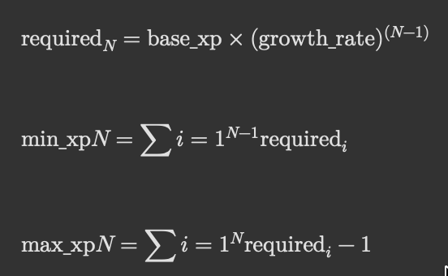

## HESAPLAMALAR

### Harflendirmeler
* V : toplam vuruş sayısı (tüm maçlardaki)
* K : toplam topu kaçırma sayısı (tüm maçlardaki)
* S : toplam süre (tüm maçlardaki)
* M : toplam maç sayısı (tüm maçlardaki)
* W : kazanılan maç sayısı (tüm maçlardaki)
* L : kaybedilen maç sayısı (tüm maçlardaki)
* XP_Win : 70 xp (maçı kazanma puanı)
* XP_Par : 10 xp (maça katılım puanı)
* XP_base : 100
* growth_rate : 1.25
* N : level seviyesi

 

### Hesaplamalar
* win rate = (W / M) x 100
* XP Hesaplama : [W x (XP_Win + XP_Par)] + (L x XP_Par)
* Level'de kaç aralık olacağını ve level mşn ve max xp noktalarını belirlemek için formüller:
   
* progress_ratio = (current_xp - min_xp_N) / (max_xp_N - min_xp_N)
* hız = (V / (S x M)) x 100
* dayanıklılık = strateji = {(S / M) / [(S / M) + 1]} x 100
* saldırı = (W / M) x 100
* savunma = { [V / (L + 1)] / {[V / (L + 1)] + 1} } x 100
* doğruluk = [V / (V + K)] x 100

 

### Level için Hesaplama Örneği
* Adım 1: level gereksinimlerini hesapla

  * Level 1
    * required_1 = 100 × 1.25^(1-1) = 100 × 1 = 100
    * min_xp_1 = 0
    * max_xp_1 = 0 + 100 - 1 = 99
  * Level 2
    * required_2 = 100 × 1.25^(2-1) = 100 × 1.25 = 125
    * min_xp_2 = max_xp_1 + 1 = 99 + 1 = 100
    * max_xp_2 = min_xp_2 + required_2 - 1 = 100 + 125 - 1 = 224
  * Level 3
    * required_3 = 100 × 1.25^(3-1) = 100 × 1.5625 ≈ 156
    * min_xp_3 = max_xp_2 + 1 = 224 + 1 = 225
    * max_xp_3 = min_xp_3 + required_3 - 1 = 225 + 156 - 1 = 380
  * Level 4
    * required_4 = 100 × 1.25^(4-1) = 100 × 1.953125 ≈ 195
    * min_xp_4 = max_xp_3 + 1 = 380 + 1 = 381
    * max_xp_4 = min_xp_4 + required_4 - 1 = 381 + 195 - 1 = 575
  * Level 5
    * required_5 = 100 × 1.25^(5-1) = 100 × 2.44140625 ≈ 244
    * min_xp_5 = max_xp_4 + 1 = 575 + 1 = 576
    * max_xp_5 = min_xp_5 + required_5 - 1 = 576 + 244 - 1 = 819

* Adım 2: kullanıcının levelini belirle
  * Örnek:
    * Kullanıcının xp'si önceden hesaplanmış ve 410 olsun.
      * Level 1: 0–99 → 410 > 99 ✅ devam
      * Level 2: 100–224 → 410 > 224 ✅ devam
      * Level 3: 225–380 → 410 > 380 ✅ devam
      * Level 4: 381–575 → 410 ∈ [381, 575] ✅ Level = 4 (level'de 4 verisi gönderilecek)

* Adım 3: XP bar hesaplaması
  * Örnek veriler:
    * min_xp Level 4 = 381
    * max_xp Level 4 = 575
    * current_xp = 410
  * progress_ratio = (410 - 381) / (575 - 381) = 29 / 194 ≈ 0.149 ≈ %15 (level_progress'te 15 verisi gönderilecek)

  

## VERİLER

Tüm her şey kullanıcının kendi verileridir.

Sekme başlığı: Header
- nickmane
- username
- profil resmi
- dil
- email
- şifre
- current streak / mevcut streak (şuanda mevcut olan)
- total games (oynalınan tüm maçların sayısı)
- win rate (win rate = (total win games / total games) x 100)
- level -> int
- level ilerleme oranı (level progress ratio) -> int

Sekme başlığı: Dashboard
- toplam kazandığı maç sayısı (oynalınan tüm maçlar)
- toplam kaybettiği maç sayısı (oynalınan tüm maçlar)
- ortalama oyun süresi (istenilen format "dakika:saniye") -> oynalınan tüm maçların toplam süresi / toplam maç sayısı
- toplam oyun süresi (örnek format "2h 3m") -> oynalınan tüm maçlardaki oyun sürelerinin toplamı
- mevcut streak
- en çok yapılabilinen streak
- son 4 maçın listesi
  - her maç için gerekli bilgiler:
    - kullanıcının o maçtaki win/loss bilgisi
    - rakip username
    - skor
    - tarih (örnek: 12.09.2025)
- haftalık olarak her güne ait yapılan maçların sayısı ayrı ayrı (her pazartesi sıfırlanır)

Sekme başlığı: Performans
- toplam kazandığı maç sayısı (oynalınan tüm maçlar)
- toplam kaybettiği maç sayısı  (oynalınan tüm maçlar)
- hız (bu değişken bir sayı olacak)
- dayanıklılık (bu değişken bir sayı olacak)
- strateji (bu değişken bir sayı olacak)
- saldırı (bu değişken bir sayı olacak)
- savunma (bu değişken bir sayı olacak)
- doğruluk (bu değişken bir sayı olacak)
- çeyreklik / yıllık ilerleme
  - Çeyreklikler:
    - quarter1 (Q1): ocak, şubat, mart
    - quarter2 (Q2): nisan, mayıs, haziran
    - quarter3 (Q3): temmuz, ağustos, eylül
    - quarter4 (Q4): ekim, kasım, aralık
  - Her bir çeyreklik için olması gerekenler:
    - o çeyreklikteki aylarda olan toplam maç sayısı
    - o çeyreklikteki aylarda olan toplam kazanılan maç sayısı
- toplam xp puanı
- maçlardaki ortalama skor farkı -> tüm maçların ayrı ayrı skor farkları alınıp toplanacak ve maç sayısına bölünerek elde edilecek bir değerdir
- 1 maçtaki en hızlı galibiyet zamanı (istenilen format "dakika:saniye")
- 1 maçtaki en uzun maç zamanı (istenilen format "dakika:saniye")

Sekme başlığı: Turnuva geçmişi
- Turnuvanın adı
- başlangıç tarihi
- bitiş tarihi
- turnuvanın oynandığı yıl
- o turnuvadaki toplam maç sayısı
- turnuva detayları için (EKLENECEK !!!!!!!!!!!!!!!!!!!!!!!!!!!!!!)

Sekme başlığı: Maç geçmişi
- maçın tarih ve saati
- rakip username
- skor
- süre (örnek format 4:23 yani 4 dakika 23 saniye)
- sonuç (galibiyet / mağlubiyet)
- maç analizi için (EKLENECEK !!!!!!!!!!!!!!!!!!!!!!!!!!!!!!)

Sekme başlığı: Achievements
- ilk maçı kazandığı tarih (tarih yoksa maçı kazanmadı demektir)
- ilk kez 10 maçı üst üste kazandığı tarih (tarih yoksa maçı kazanmadı demektir)
- 3 dakikadan kısa sürede maçı kazandığı ilk tarih (tarih yoksa maçı kazanmadı demektir)
- 100 maç kazandığı ilk tarih (100 maç kazanmadıysa kaç maç kazandığı yazmalıdır)
- 25 maç üst üste kazandığı ilk tarih (25 maç üst üste kazanmadıysa kaç maç kazandığı yazmalıdır)
- 500 maç oynadığı ilk tarih (500 maç oynamadıysa kaç maç oynadığı yazmalıdır)
